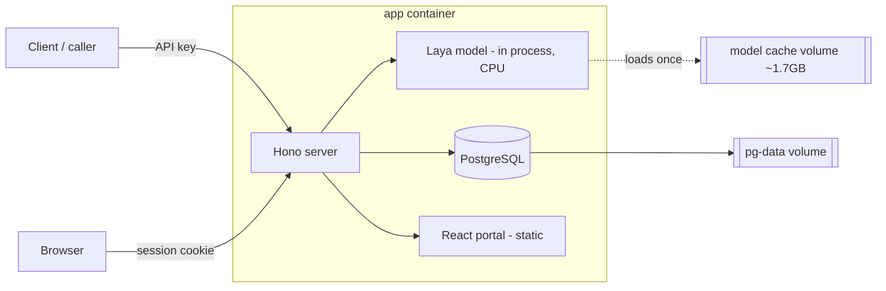

# Laya Service

A self-hosted deployment of **[Laya](https://github.com/receptron/laya)** — an
open-weight *decision* model — wrapped with a management **portal**, an
**API-key-gated inference endpoint**, and a full **admin key-management** layer.


Laya doesn't generate text — you hand it a **state** (a ticket, an email, any
JSON) plus **typed questions**, and it returns **calibrated probabilities** in a
single forward pass. It's built for the routine classification work that usually
gets sent to expensive frontier models: routing, prioritisation, moderation,
yes/no checks. This project makes one instance easy to run, share behind API
keys, and operate.

## Features

- **Inference API** (`/v1/inference`) — generic passthrough to Laya's three
  question types: `choice`, `score`, `noul` (boolean).
- **API keys** — hashed at rest (shown once), with per-key **expiry, rate limit,
  usage quota, and scopes**, all with sensible defaults.
- **Management portal** — a React SPA with a live dashboard, key CRUD, request
  logs, and an admin audit log.
- **🧩 Puzzle Playground** — build an inference request by dragging puzzle
  pieces (`state`, `type`, `instructions`, `criteria`) into their slots; the
  `criteria` slot reshapes to match the chosen type. Includes a raw-JSON escape
  hatch, one-click examples, and probability-bar results.
- **Installable PWA** — add-to-home-screen, offline app shell, mobile-responsive.
- **Two auth layers** — a master secret for machine-to-machine admin calls, and
  a portal login (signed-cookie session) for the UI.
- **CI/CD** — push to `main` → GitHub builds a Debian-slim image → pushes to
  GHCR → a self-hosted runner pulls and recreates the stack, health-gated.

## Architecture



One Node/TypeScript process (**Hono**) loads the Laya model once, serves the
inference + admin APIs, and hosts the built React portal. **PostgreSQL** (via
**Prisma**) stores keys, usage, logs, and the admin user. Everything ships as a
single image plus a `postgres` service via Docker Compose.

## Tech stack

| Layer | Choice |
|---|---|
| API server | Hono + TypeScript on Node 20 |
| Model runtime | [`@receptron/laya`](https://www.npmjs.com/package/@receptron/laya) (ONNX Runtime, CPU) |
| Database | PostgreSQL + Prisma |
| Auth | Hashed API keys · master secret · `hono/jwt` cookie sessions · bcrypt |
| Portal | React + Vite + `@dnd-kit` (light glassmorphism design system) |
| Packaging | Multi-stage Docker (Debian-slim, non-root) + Compose |
| CI/CD | GitHub Actions → GHCR → self-hosted runner |

## API reference

### Inference — `POST /v1/inference`

Auth: `Authorization: Bearer <api-key>` or `X-API-Key: <api-key>`.

```bash
curl -X POST https://<host>/v1/inference \
  -H "Authorization: Bearer laya_xxx" \
  -H "content-type: application/json" \
  -d '{
    "state": { "email": "I was double charged, please refund" },
    "questions": {
      "department": {
        "type": "choice",
        "instructions": "Route this ticket",
        "criteria": { "billing": "payments", "technical": "bugs", "account": "access" }
      }
    }
  }'
```

```jsonc
{
  "model": "laya",
  "answers": {
    "department": {
      "type": "choice",
      "choice": "billing",
      "probabilities": { "billing": 0.94, "technical": 0.03, "account": 0.03 },
      "confidence": 0.75
    }
  },
  "usage": { "input_tokens": 46, "output_tokens": 0 }
}
```

Question types: **choice** (`criteria` = options map or list) · **score**
(`criteria` = ordered levels) · **noul** (`criteria` = optional `{true,false}`
labels; returns `P(true)`).

### Other endpoints

| Method | Path | Auth | Purpose |
|---|---|---|---|
| GET | `/health` | none | liveness |
| GET | `/status` | none | model state, uptime, memory |
| GET | `/v1/me` | API key | calling key's metadata & remaining quota |
| POST | `/auth/login` · `/auth/logout` · GET `/auth/session` | — / session | portal login |
| POST/GET/PATCH/DELETE | `/admin/keys[/:id]` | master secret or session | key management |
| GET | `/admin/usage` · `/admin/logs` · `/admin/audit` | admin | dashboards |
| POST | `/admin/inference` | admin | run inference from the playground |

Admin auth: `X-Admin-Secret: <secret>` (or `Authorization: Bearer <secret>`), or
a valid portal session cookie.

## Local development

```bash
cp .env.example .env                         # then edit the secrets
docker compose -f docker-compose.dev.yml up -d   # local Postgres
npm install
npm run prisma:migrate:dev                   # or: npm run db:push
npm run dev                                   # http://localhost:8080
```

Set `LAYA_DISABLE_MODEL=1` in `.env` to skip the ~1.7 GB model download while
working on the API/portal (inference then returns `503`). The portal dev server
with API proxy is available separately via `cd web && npm run dev`.

## Configuration

| Variable | Required | Notes |
|---|---|---|
| `DATABASE_URL` | yes | PostgreSQL connection string |
| `LAYA_ADMIN_SECRET` | yes | master secret for the admin API (≥16 chars) |
| `ADMIN_USERNAME` / `ADMIN_PASSWORD` | yes | seeds the portal login on first boot |
| `SESSION_SECRET` | yes | signs session cookies (≥16 chars) |
| `PORT` | no | in-container port (default 8080) |
| `LAYA_CACHE` | no | model cache dir (default `~/.cache/receptron-laya`) |
| `LAYA_DISABLE_MODEL` | no | `1` to skip loading the model (dev/CI) |

## Deployment

Multi-stage **Debian-slim** image (never Alpine — the ONNX runtime is a glibc
native module), non-root, with the model weights in a named volume so they
survive redeploys. `docker-entrypoint.sh` syncs the schema (`prisma db push`)
then starts the server. The GitHub Actions workflow builds on GitHub's runners,
pushes to GHCR, and a **self-hosted runner** on the target host pulls and
recreates the stack with a health check. Runtime secrets live in an `.env` on
the host (see `deploy/.env.server.example`), never in the image or git.

## Project structure

```
src/            Hono app: routes (/v1, /admin, /auth), auth, model wrapper, db
prisma/         schema (ApiKey, UsageEvent, AuditEvent, AdminUser)
web/            React + Vite portal (built to web/dist, served by the app)
Dockerfile      multi-stage build (web · deps · builder · runtime)
docker-compose.yml   app + postgres (production)
.github/workflows/deploy.yml   test → build/GHCR → deploy
deploy/         server-side .env template
```

## Security notes

- API keys are stored only as SHA-256 hashes; the full key is shown once.
- The admin password is bcrypt-hashed; the master secret is compared in
  constant time.
- The service worker never caches `/auth`, `/admin`, or `/v1` responses.
- No secrets are committed — `.env` is git-ignored and examples use placeholders.

## Roadmap

- Switch `prisma db push` → committed migrations
- Trim the runtime image size
- Per-task saved templates in the playground
- Fine-tuning workflow docs

## Credits

- **Laya** model by [Convai Innovations](https://github.com/receptron/laya)
  (weights Apache-2.0); the `@receptron/laya` ONNX runtime is MIT.
- This project is MIT licensed — see [LICENSE](./LICENSE).
